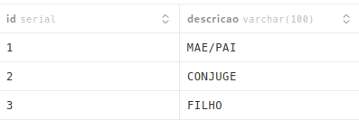

# ELECTRON
- comando para gerar o .exe no windows: npm run electron:build:win
- IMPORTANTE: é preciso copiar o .env com as informações do banco de dados pra dentro da pasta onde o executável está. Exemplo:
- dist-electron/win-unpacked/
├── CPG.exe
└── .env    ← here
# To do

- [x] Banco de dados;
- [x] Página de criação de pessoa;
  - [x] Adicionar relação + criar nova pessoa (só nome, sobrenome e sexo) para adicionar relação;
  - [x] Adicionar data e local de casamento;
  - [x] Adicionar local;
- [x] Visualização em lista de pessoas;
  - [x] Pesquisar por nome, sobrenome;
- [x] Visualizar pessoa;
- [ ] Atualizar dados de pessoa;
- [ ] Visualização em árvore;
- [ ] Buscar relação entre duas pessoas (função twopoint_search);
- [ ] Botão de backup (download de arquivos do postgres);
- [ ] Relatório;
- [ ] Manual de uso;

# Rotas
## Local
### GET
- /api/local -> busca todos os locais;
- /api/local; query: {string}-> busca locais que contenha a string no nome;
### POST
- /api/local -> salvar novo local
  - body: {
    descricao: string,
    estado: char[2]
  }
## Pessoa
### GET
- /api/pessoa -> busca todas as pessoas
- /api/pessoa; query: {nome: string} -> busca pesssoas que contenham a string no nome ou sobrenome
- /api/pessoa; query: {id: int} -> busca pessoa com ID específico
### POST
- /api/pessoa -> salva nova pessoa
  - body: {
    nome: string,
    sobrenome: string,
    sexo: char,
    datanasc: date,
    localnasc: int,
    databatismo: date,
    localbatismo: int,
    datamorte: date,
    localmorte: int,
    obs: text,
    relacoes: [{
      p2: int,
      rel: int,
      metadata: json
    }]
  }
### PUT
- /api/pessoa/{id} -> atualiza registro de pessoa com id correspondente
  - body: {
    nome: string,
    sobrenome: string,
    sexo: char,
    datanasc: date,
    localnasc: int,
    databatismo: date,
    localbatismo: int,
    datamorte: date,
    localmorte: int,
    obs: text,
    relacoes: [{
      p2: int,
      rel: int,
      metadata: json
    }]
  }


# Nuxt Minimal Starter

Look at the [Nuxt documentation](https://nuxt.com/docs/getting-started/introduction) to learn more.

## Setup

Make sure to install dependencies:

```bash
# npm
npm install

# pnpm
pnpm install

# yarn
yarn install

# bun
bun install
```

## Development Server

Start the development server on `http://localhost:3000`:

```bash
# npm
npm run dev

# pnpm
pnpm dev

# yarn
yarn dev

# bun
bun run dev
```

## Production

Build the application for production:

```bash
# npm
npm run build

# pnpm
pnpm build

# yarn
yarn build

# bun
bun run build
```

Locally preview production build:

```bash
# npm
npm run preview

# pnpm
pnpm preview

# yarn
yarn preview

# bun
bun run preview
```

Check out the [deployment documentation](https://nuxt.com/docs/getting-started/deployment) for more information.

NUXT HUB:
https://hub.nuxt.com/docs/getting-started/installation

DRIZZLE:
https://hub.nuxt.com/docs/database

Pra conectar ao banco é preciso ter um arquivo .env na pasta root do projeto com o a URL da Database